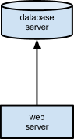
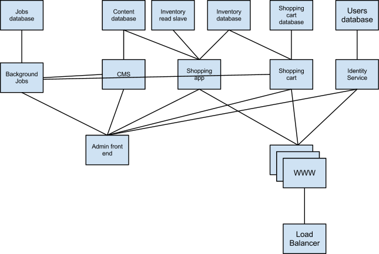
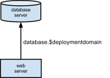

# DNS Deployment Domains

Michael Winser - michaelw@michaelw.net

## Introduction

This document describes an approach to the configuration and management of complex multi-node applications.  The approach emphasizes [convention over configuration](http://www.google.com/url?q=http%3A%2F%2Fen.wikipedia.org%2Fwiki%2FConvention_over_configuration&sa=D&sntz=1&usg=AFQjCNEfy0QlNodCBXoF8UDvTId5x_Gagg).  The result is that the cost and complexity of creating and testing a deployment is dramatically reduced.  This encourages developers and testers to create new deployments as needed and prevents the sole production domain from being a unique and special place.

## Goals

The goal of DNS Deployment domains is to provide a well defined best practice for managing complex deployments.  This approach optimizes operational and architectural simplicity and developer productivity over deployment flexibility.

## Application Scenarios

A simple application is one with only a single server role.  All other services are part of the infrastructure.  An example of this would be a web application running in the environment provided by a hosting service like Dreamhost, GoDaddy or even Heroku.  In such an environment the database is an abstract service that the application development team takes for granted.

A complex application will have multiple server roles that are created and managed by the development team.  The simplest possible configuration is one of multiple services with no dependencies.  The services are consumed by one or more clients.  A more typical configuration is a layered stack of services with explicit dependencies.

The most recognizable scenario is one of a web server and database.  The web application must be connected to the database.  This trivial problem is usually solved with explicit configuration for the database connection.  This information is often spread between explicit configuration files and implicit references to tables and columns.

A truly complex application goes beyond the simple web server / database server pair and requires many separate services all playing roles in an architecture that sometimes defies documentation.  Put simply, there are a lot of moving parts.  Below is a completely made up example of a complex system.

## Problem Statement

The problem with complex applications is that the deployment and configuration of all the moving parts often becomes part of the deployment scripts rather than the source code of the application.  These deployment scripts are non trivial and often become focused on the One True Production deployment rather than smaller dev and test scenarios.  Developers are sometimes unable to actually deploy the application themselves and depend on a central, shared dev deployment that is maintained by someone else.  Not only does this make the normal development cycle less efficient, it also takes control of the application architecture away from the main development team and turns it into a special sacred place that few may understand and even fewer can change.

Boiled down to its essence, the configuration problem is one of nodes and edges.  Each node represents an architectural entity, a single moving part.  Each edge represents a relationship between two nodes. The result is a graph that defines the system architecture.  Most architectures go further to create a directed acyclic graph because most of the dependencies are in one direction.  The architectural diagrams are a visual representation of the dependency graph of the system.

The problem is is to allow complex architectures to be easily deployed in a variety of physical server configurations.

## Symbolic Relationships

Anyone who has created a large architecture diagram that some of the connecting lines and dependencies are so common that they should not be drawn.  It would be silly to draw lines between every node and a DNS server.  Therein lies the solution to the problem.

Instead of explicit configuration for every connection we will rely on a convention that allows each component to resolve the connection dynamically.  Each node or role in the system has a well defined symbolic name.  This name can be baked into the source code of any system code because it is a convention of the system.  “Source code” of an application can include xml and yaml configuration files.
Every deployment will have a single, simple configuration value: the name of the deployment.  All nodes will be addressable by combining the symbolic name of the node with the deployment’s name.

The arrows in our diagrams are the arcs of our graph.  In our source code they are symbols that can be resolved at runtime to the actual service.

These symbols can be stored as configuration data, source code constants or even as a string literal inside a helper function.  The exact form depends much on the implementation of a particular service.
Each service is still responsible for initializing itself and expanding configuration values to actual names but this is generally trivial.  In a Rails application this expansion can be made implicit because the YAML config files will automatically expand variable references.

By putting these relationships into the source code they become a fully versioned part of the application.  My separating these relationships from the specifics of a particular deployment we make deployments easier and more flexible.

## A Simple Example

Let’s look at the simple scenario of a web application server and database server again.  The architecture diagram already suggests the names of our convention.  We will use “web” to refer to the application server and “database” to refer to the database server.  These names are completely arbitrary.
  
In the application server source we will create a configuration record that tells the application to connect to the database at “database.$deploymentdomain” where $deploymentdomain is obviously a variable to resolved at runtime or even deployment time.  The only configuration setting that needs to be established when creating the deployment is the name of the deployment.  Again we can establish a convention whereby the name of the deployment is always stored in a common location (e.g /etc/sysconfig/mybigarchitecturename.domain).

DNS is the Glue

The astute reader will have noticed that the deployment domain and the resolved server names are trivially implemented using DNS.  The deployment domain is a DNS domain (e.g. example.com).  Each node name is a subdomain of the deployment domain.  The combination of the two is a valid DNS name that can be used directly in most communication protocols (e.g. http or database).

DNS is not the only way to do this.  It is however incredibly convenient and flexible.  DNS is the glue of the internet.  It lends itself to both manual and automatic management.  It is flexible, robust and scalable.  Mechanisms like CNAME records make aliasing easy.  We will see later on how useful this can be.

## Deployment Domains in Practice

DNS doesn’t magically make the provisioning, installation and configuration of servers go away.  What it does is create a very clear separation between the application source code and the deployment configuration.

A deployment can now be thought of as a separate entity.  Deployments can be created by hand or in a fully automated devops way.

A system is:

 - A set of components, typically applications and services.
 - The intra-application setup and configuration files and scripts for each component.
 - The arcs between those applications and services

A well managed development process will ensure that every part of the system is versioned and continuously integrated.  It will also ensure that each component can be setup and configured independently.

A deployment is defined by:

- The system (combination of source code, build artifacts and intra-application configuration)
- A pool of servers (physical or virtual)
- A deployment domain name (e.g. deployment.example.com)
- DNS records that bind the symbolic system component names to one or more servers
- An explicit or implicit map that assigns system components to individual servers
- DNS records that bind the symbolic 

By definition, the processes, scripts, engines and whatnot that are used to actually materialize a working domain are separate from the actual deployment.  The mechanisms used and how easily they can be parameterized is beyond the scope of this document.  For simple systems a wiki document describing the deployment steps can be sufficient.  For large complex systems fully automated solutions using configuration management systems like Chef or Puppet can be helpful.  In practice, development often starts out with hand deployed components and automated devops trail behind as the architecture definition becomes more permanent.

## Example DNS Deployment Domains

The above example should make it obvious how the same source code can be deployed and trivially configured for several deployments:

    production.example.com
        database.production.example.com
        web.production.example.com

    staging.example.com
        database.staging.example.com
        web.staging.example.com

    qa.dev.example.com
        database.qa.dev.example.com
        web.qa.dev.example.com

    continuousintegration.dev.example.com
        database.continuousintegration.dev.example.com
        web.continuousintegration.dev.example.com

    playground.dev.example.com
        database.playground.dev.example.com
        web.playground.dev.example.com

    michaelw.dev.example.com

        database.michaelw.dev.example.com
        web.michaelw.dev.example.com

The above list of deployments is more than just an example, it’s a good pattern.  Any large development project will have deployments for continuous integration, qa, staging and production.  The playground deployment is a place for developers to do their own experimentation and collaboration as components come together.

The individual deployment is key.  Each developer should be able to create a personal deployment that allows them to develop and debug one or more components in the context of the entire system.
Simple deployments are where all the components run on a single server.  The DNS config for such a deployment is a wildcard:

    *.playground.dev.example.com CNAME server1.ops.example.com

Developers can either setup individual domains or use /etc/hosts.  
A recently released service by 37signals provides a special DNS server called xip.io that makes this scenario even easier.  DNS provides wildcard DNS for any IP address.  For example requests to www.10.0.0.1.xip.io will resolve to 10.0.0.1.  This allows the developer to define a deployment domain for the IP address of a workstation.  For more information visit http://xip.io/  

Production deployments can use DNS APIs to automatically setup the DNS for a deployment just as they might also use APIs to a load balancer to add servers into the pool.

## Shared Nodes

The individual developer scenario presents an interesting opportunity.  It is not always convenient for a developer to build and run every single component on their development workstation.  There are many factors that can contribute to this including build time, system memory/cpu/disk and even meaningful data.  In practice, most developers work on a small subset of the overall system and will treat most of other components as black boxes taken for granted.

The solution is simple.  Any deployment domain can reuse components from another domain simply by pointing the appropriate DNS records to the service.  Using the examples above:

    michaelw.dev.example.com
        database.michaelw.dev.example.com CNAME  database.playground.dev.example.com
        web.michaelw.dev.example.com A 127.0.0.1

The michaelw.dev.example.com deploymentis now using the database component from the playground.dev.example.com deployment.

Effective use of this approach is not free.  The above reference could mean that the michaelw deployment is using just the database server or the actual database.  If both are possible and desired then the system architects can define two roles: databaseserver and userdatabase for example.  In practice this is usually obvious from the context.

## Load Balancing Caveat

In limited circumstances DNS can be used as a simplistic load balancer.  This is because most browser clients will randomly pick an address when the DNS record returns more than one.  This approach can be coded into other protocol stacks as well but it is not really suitable for production use.  If an intermediate service, aka a load balancer, is needed for distributing load horizontally then it should be an explicit part of the system architecture.

## Conclusion

DNS based deployment domains:
- Force good separation of concerns between application code, system architecture and ops.
- Reduce the complexity of deployments
- Increase the flexibility and range of deployment options
- Improve developer productivity

Every system is different and the application of the ideas in this document will vary accordingly.  There will always be exceptions and oddities.  Your mileage may vary, not applicable in Hawaii, must have 18+ years of experience building hairballs, void where prohibited.